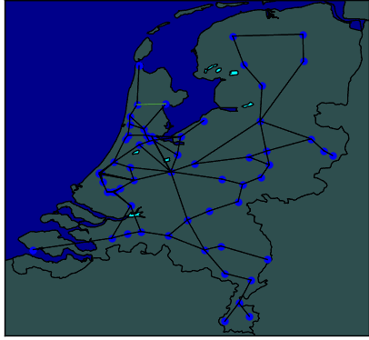

# Wissselstoring
This project contains a python program which aims to provide the most optimal solution for rail routing across the Netherlands.
It does this by implementing several algorithms and heuristics with the aim of providing the most optimal solution for the routes.
Additionally, this program provides the option of visualising the routes in .PNG, .GIF format and can create insights in histogram form on the solutions.



# Getting started:
To get started, some actions are required. First, multiple python packages are required for the program to run. These can be installed by using the following command:

```pip install -r requirements.txt```

# Outline:
After downloading the code, you will find the files divided into multiple folders.
* Wisselstoring: this is the main folder where you can navigate to other folders and read the text files.
* Code: this is the main folder containing all the python code files, including the main.py. In the code folder you can find the following 2 folders as well:
    * algorithms: containing all the different algorithms.
    * heuristics: containg the heuristics in different files.
* Data: this folder contains the important csv files with the data about the trains station and connections.
* Gifgen: This folder will hold images of all the seperate routes, after running the code.
* Images: After running the code, this folder contains the maps with the train stations and the connections. Moreover, it has a gif that has the routes of the trajectories animated.
* Results: The results of the trajectories will be exported to csv files, that will show up in this folder after running the code.

# Algorithms:
This program has the ability to run  different algorithms, each providing  seperate output for comparison.
These algorithms can be found in the folder Algorithms (Wisselstoring/Code/algorithms).

### Types of algorithms:
The following algorithms are used:
1. Random Algorithm
2. Greedy Algorithm
3. Heuristic Algorithm
4. Simulated Annealing Algorithm
5. Dijkstra Algorithm

The detailed explanations about the algorithms you can find [here](/Code/algorithms/README_ALGORITHMS.md).

### Usage:
By default the program is run with the following command:

```python3 main.py```

This will run the program for 1 run, using the random algorithm.

To run this program for multiple runs please use the following command:

```python3 main.py a n (Example: python3 main.py 500 1)```

Where a is the amount of runs (1 - ∞) and n is the algorithm selector (1 - 5, as seen in types of algorithms)

# Heuristics:
The algorithms 'Dijkstra', 'Simulated Annealing' and 'Heuristics' can be combined with the following start and move functions, of which some include a heuristic.
This program is also able to utilize the following heuristics:

**Start heuristics:**
1. Random start heuristic
2. Least connections start heuristic
3. Most connections start heuristic
4. Seven bridges start heuristic

**Move heuristics:**
1. Random move heuristic
2. Visited random move heuristic
3. Shortest move heuristic
4. Preference shortest move heuristic

The detailed explanations about the heuristics you can find [here](/Code/heuristics/README_HEURISTICS.md).

For  algorithms 3-5 heuristics have to be selected. This can be done using the following command:

``` python3 main.py a n s m (Example: python3 main.py 500 1 3 3) ```

Where s is the start heuristic (1-4) and m is the move heuristic (1-4)

# Histogram:
Automatically when running the program, the quality of every run is being saved in a seperate file in the folder "results". In order to generate a histogram, the user can use the following command:

```python3 histogram.py```

The question "which score?" will pop up. The user can fill in the combination of numbers of the result file they wish to use for the histogram.

For instance for the following combination, a resultsfile named "score322.txt" will be created.

``` python3 main.py 1 3 2 2 ```

The user can call the histogram.py and answer the question with "322", and a histogram based on the information in the score322 file will be created.

By entering "stop" the program will stop running, until then the user can request as many histograms as there are result files.


# Experiments:
For our experiments we ran each algorithm (In combination with heuristics where applicable) 5000 times. As there are 50 possible combinations we will simply summarize the best findings for each algorithm. To perform your own tests, please see replication

**Best combinations:**

Random algorithm(1): Mean 1981 Highest 2741

Greedy algorithm(2): Mean 4455 Highest 4655

Heurisitc algorithm, Least connections start, Visited random move (322): Mean 6108 Highest 7020

Simulated Annealing, Seven bridges start Heuristic, Preference shortest move heuristic (442): Mean 5867

Dijkstra algorithm, Least connections start, Visited random move (522): Mean 3508 Highest 4276

## Replication

To replicate these all of these findings please run the following code:

``` python3 experiments.py ```

Which will run all algorithms and combinations 5000 times, after which you can create histograms by running 

``` python3 histogram.py ```

Which will prompt the user for the combination you wish to plot (For example, entering 322 will give the histogram for algorithm 3, start and move heuristic 2.)

Sidenote, not all combinations have to be run to get valid results. Manually calling the combinations with *python3 main.py 5000 2 3 3* is also possible for each combination, or changing the code in experiments.py to reflect the algorithm, start, or move heuristic combination you want are all possible.

# Discussion:

In theory, the highest possible score is 7549. It requires 1551 minutes to visit all connections. For this, you need 9 trains.
This yields the formula: K = p*10000 - (T*100 + Min) =  1 * 10000 - (9 * 100 + 1551) = 7549.

Using a complete random algorithm, we found that the mean score produced was 1981. The algorithms we created produce scores somewhere between the values above, with a top score of 7020. This is approaching the maximum score. Thus far it seems maximizing the value of p is worth more than driving less trains/less minutes. This because for every % loss of p already means -100 which is equal to the starting costs of a single train line. It seems heuristics paying attention to undriven routes with the least amount of time outperform the other options. 
